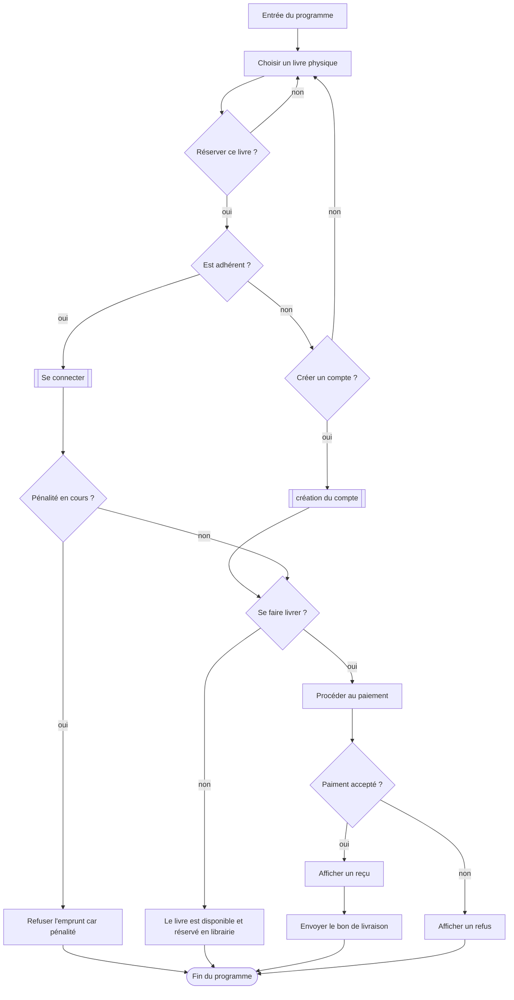
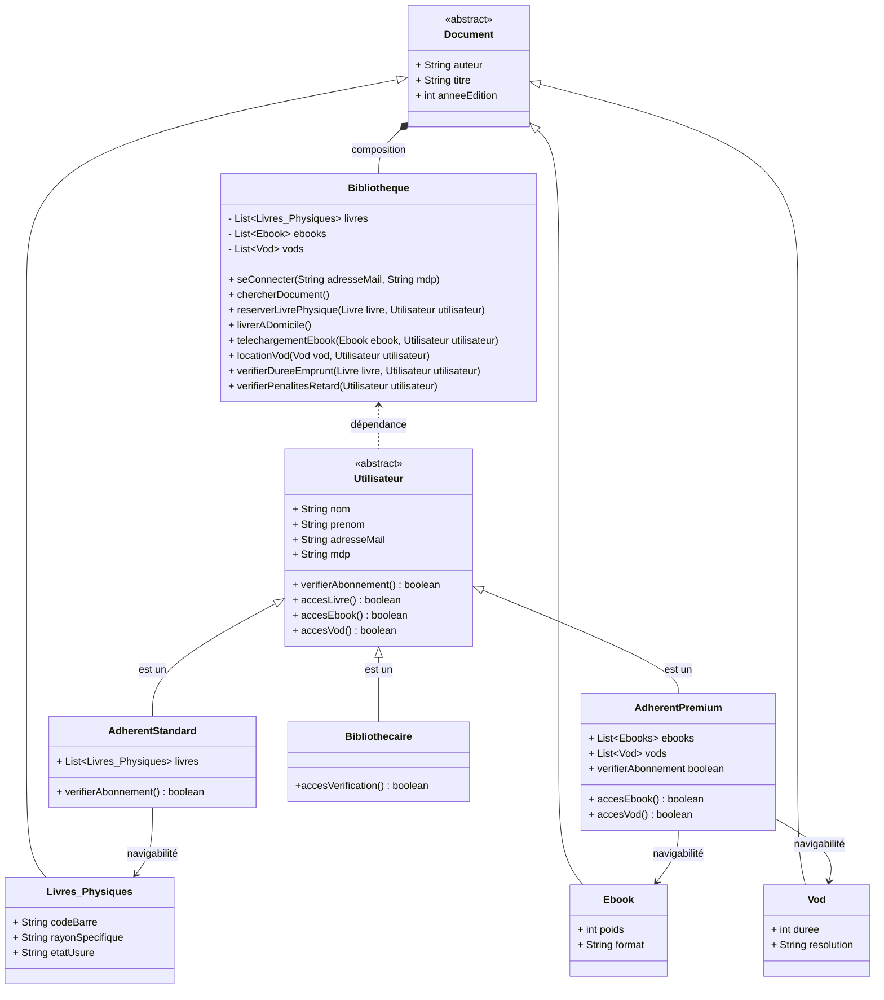

# Résumé du Projet OmniLib
OmniLib est un projet visant à créer un portail qui répertorie des livres physiques et virtuels, en les proposant parmi un catalogue. En plus du visiteur qui ne bénéficie d'aucun service, le projet comprends plusieurs offres (adhérent standard qui paie 5€ par mois pour empruter des livres physiques en ayant la possibilité de se les faire livrer, ainsi que l'adhérent premium qui paie 10€ par mois pour pouvoir emprunter des livres physiques, vod, ebooks). L'utilisateur ne peut pas bénéficier des services précédants s'il fait l'objet d'une pénalité active. Les bibliothécaires peuvent altérer le catalogue via leur propre compte.

Conformément à la demande de notre client, Michel L.E, nous avons établi les diagrammes suivants afin de récapituler les étapes principales de l'application et son architecture global. Nous avons aussi inclus un diagramme expliquant globalement le cas de la réservation d'un livre.

## DIAGRAMME DE CAS D'UTILISATION

## DIAGRAMME D'ACTIVITE (Réservation d'un livre)

## DIAGRAMME DE CLASSE

